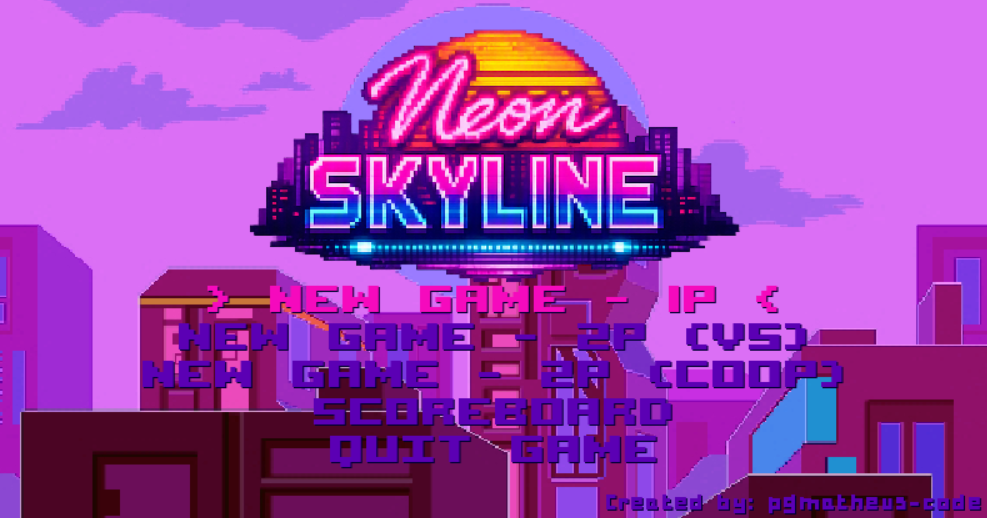
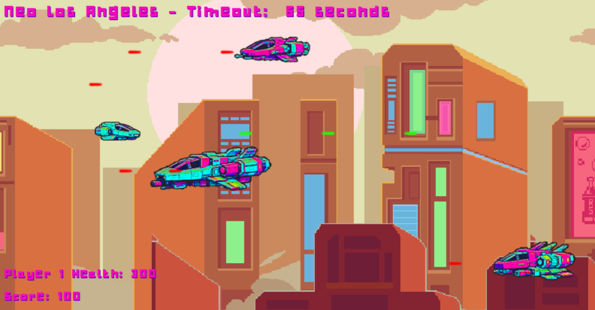
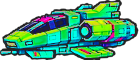

# Neon Skyline (Pygame) 🚀🌆

---

## 🙏 Credits & Inspiration

This project was inspired by the work of my professor (Vinicius Borin), who guided me through recorded classes on the study platform and
encouraged improvements.  
The original project can be found here: [MountainShooter](https://github.com/borinvini/MountainShooter).

While **Neon Skyline** is based on concepts and code demonstrated in those classes, all implementation was done step by
step by me,
with different audio and image assets, resulting in a visually distinct game.

**Feel free if you want to contribute.**

---

- Main menu:
  

**Neon Skyline** is a sci‑fi side‑scrolling vessel shooter where you pilot a small flying car through hostile futuristic
skies.  
Battle against other vehicles across four dangerous cities, each with its own atmosphere and challenges:

- **Neo Los Angeles**
- **Tokyo Nexus**
- **Chicago Overdrive**
- **Detroit Steel**

## 🎮 Game Modes

The game offers three distinct styles of play:

- **1 Player** — classic solo run.
- **2 Players Versus** — head‑to‑head competitive mode.
- **2 Players Cooperative** — team up to survive together.

## 🗄️ Score System

Player scores are stored using **SQLite3**, ensuring persistence and easy tracking of high scores across sessions.

## 🏫 Project Context

This game was developed as a **faculty project** for *Uninter*, in the subject **Linguagem de Programação** (Programming
Language).
It serves as a test of programming concepts applied to game development, blending retro aesthetics with modern
mechanics.

- Neo Los Angeles 1P Gameplay:  
  

## ✨ Features

- Pixel‑art retro neon visuals.
- Four unique city scenarios.
- Local multiplayer versus and coop (in the same device, no LAN).
- Persistent scoreboard with SQLite3.

## 🚀 Main Entities

### Player Vessels

- Player 1  
  

- Player 2  
  

### Enemy Vessels

- Small Foe  
  

- Medium Foe  
  

- Large Foe  
  

## ▶️ How to Play
Just run the NeonSkylineGame.exe located in the root directory. 

### 🎹 Controls

| Action     | Player 1  | Player 2            |
|------------|-----------|---------------------|
| Move Up    | **W**     | **↑** (Arrow Up)    |
| Move Down  | **S**     | **↓** (Arrow Down)  |
| Move Left  | **A**     | **←** (Arrow Left)  |
| Move Right | **D**     | **→** (Arrow Right) |
| Shoot      | **Space** | **Keypad +**        |

💡 *New key bindings can be set in the `Const.py` file if you want to customize the controls.*

---

## 🙏 Credits & Inspiration

This project was inspired by the work of my teacher, who guided me through recorded classes on the study platform and
encouraged improvements.  
The original project can be found here: [MountainShooter](https://github.com/borinvini/MountainShooter).

While **Neon Skyline** is based on concepts and code demonstrated in those classes, all implementation was done step by
step by me,
with different audio and image assets, resulting in a visually distinct game.

---

Made with 💻 and 🎮 by [**pgmatheus-code**](https://github.com/pgmatheus-code)
